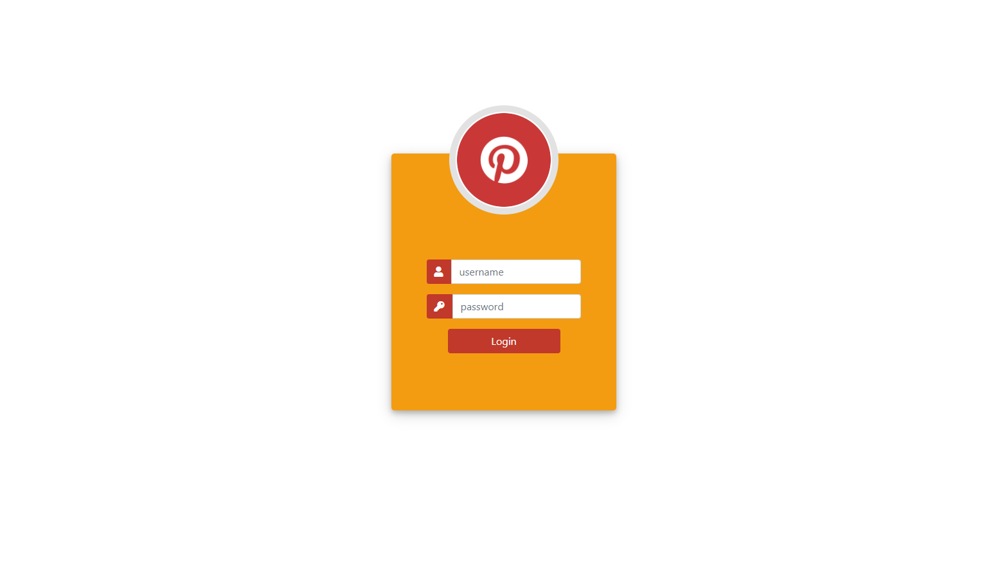
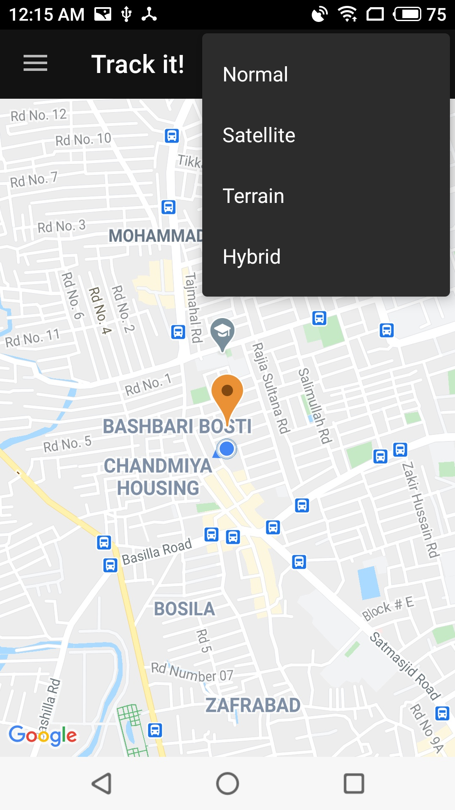
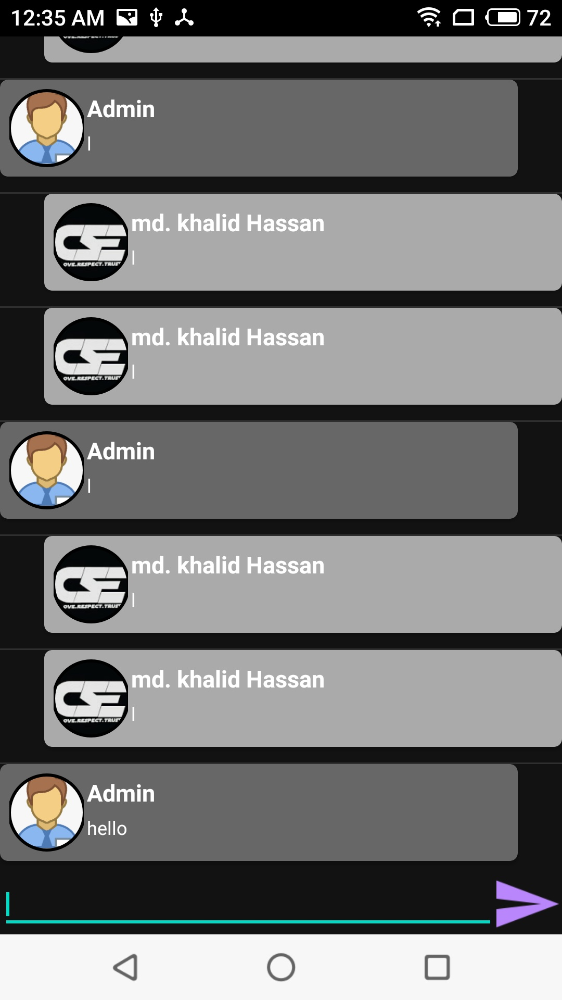

# TrackingApp

This project is a tracking app.
- It continuously log the device location and send 
them to server. Also, plot the location in both app 
and admin panel. Chat is also available between 
user and admin.
- Google maps is used for tracking device location.
- Firebase is used for messaging.

# Admin Panel

 

# App

    

